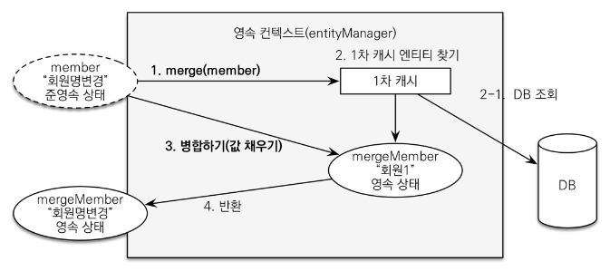

데이터 수정
=========
1. Merge(병합)
   * 준영속 상태의 엔티티의 값을 영속상태의 엔티티에 덮어쓴다.
   * null 까지 덮어쓰므로 잘 쓰지 않는다.
    
2. JPA 변경감지
    * 영속 상태를 적극 사용한다.
    * form 객체의 정보를 영속상태 엔티티에 직접 set한다.

Controller - service 사이
* 컨트롤러에서 엔티티를 서비스에 념겨주기 보단 id만 넘겨주는것이 낫다.